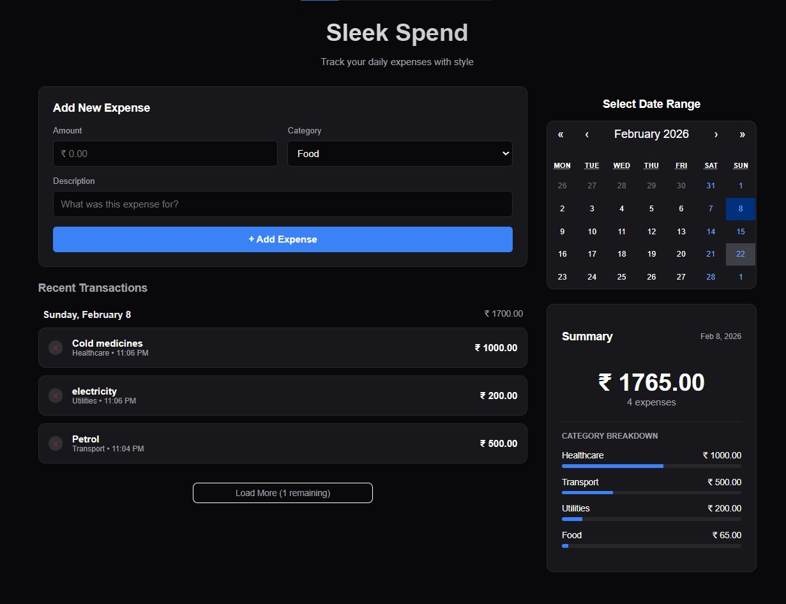
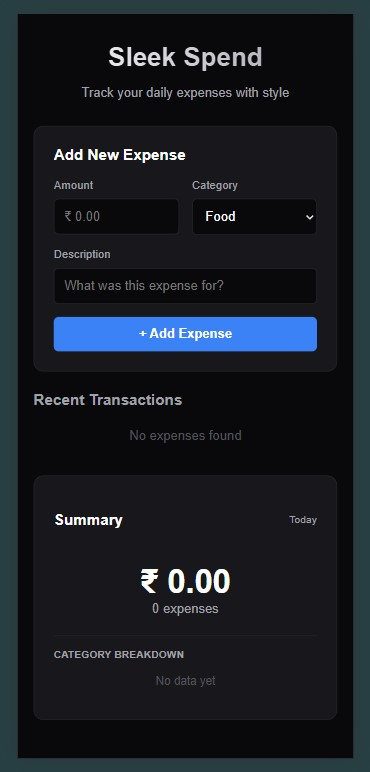

# 💸 Sleek Spend – Expense Tracker


A modern, dark-themed daily expense tracker built with **React + Vite**.

Sleek Spend allows you to:

- Track daily transactions
- Categorize expenses
- Visualize spending habits
- Filter by date using an interactive calendar
- Store everything locally (no backend required)

---

## 🌍 Live Demo

👉 https://Gulzhub.github.io/expense-tracker

---

## 📸 Screenshots

### 💻 Desktop View



### 📱 Mobile View



---

# ✨ Features

## 📅 Interactive Calendar Filtering

- Filter by **single day**
- Select **custom date ranges**
- Built using `react-calendar`

## 📊 Real-Time Analytics

- Total expense summary
- Transaction count
- Category breakdown
- Dynamic progress bars

## 💾 Persistent Storage

- Uses browser `localStorage`
- No database required
- Data never leaves your device

## 🗂 Smart Grouping

Transactions are automatically grouped as:

- Today
- Yesterday
- Formatted dates

## 📱 Fully Responsive

- Mobile-first layout
- Flexbox + Grid
- Clean dark theme

## ⚡ Quick Expense Management

- Add transactions instantly
- Delete entries with one click

---

# 🛠 Tech Stack

| Category   | Technology                       |
| ---------- | -------------------------------- |
| Frontend   | React 18 (JSX)                   |
| Build Tool | Vite                             |
| Styling    | Custom CSS (Dark Mode Optimized) |
| Packages   | react-calendar, gh-pages         |

---

# 🚀 Getting Started (Local Setup)

## 1️⃣ Prerequisites

Make sure you have installed:

- Node.js
- npm (comes with Node)

---

## 2️⃣ Clone the Repository

```bash
git clone https://github.com/Gulzhub/expense-tracker.git
```

---

## 3️⃣ Navigate to Project Directory

```bash
cd expense-tracker
```

---

## 4️⃣ Install Dependencies

```bash
npm install
```

---

## 5️⃣ Start Development Server

```bash
npm run dev
```

Now open:

```
http://localhost:5173
```

---

# 📂 Project Structure

```
expense-tracker/
│
├── public/
│
├── src/
│   ├── components/
│   │   ├── ExpenseForm.jsx      # Captures new transaction data
│   │   ├── ExpenseList.jsx      # Renders grouped & sorted transactions
│   │   └── ExpenseSummary.jsx   # Calculates totals & category breakdown
│   │
│   ├── App.jsx                  # State management & filtering logic
│   ├── index.css                # Global styles
│   └── main.jsx                 # React entry point
│
├── index.html
├── package.json
├── vite.config.js               # Includes base path for GitHub Pages
├── .gitignore
└── README.md
```

---

# 🌐 Deployment (GitHub Pages)

## Step 1: Configure Base Path

Ensure your `vite.config.js` includes:

```js
base: "/expense-tracker/";
```

---

## Step 2: Deploy

```bash
npm run deploy
```

After a few minutes, your site will be live at:

```
https://Gulzhub.github.io/expense-tracker
```

---

# 🤝 Contributing

Contributions, issues, and feature requests are welcome.

### Steps:

1. Fork the repository
2. Create a new branch
   ```
   git checkout -b feature/YourFeature
   ```
3. Commit changes
   ```
   git commit -m "Add YourFeature"
   ```
4. Push branch
   ```
   git push origin feature/YourFeature
   ```
5. Open a Pull Request

---

# 📄 License

This project is licensed under the **MIT License**.

---

# 👤 Author

**Gulzhub**

GitHub: https://github.com/Gulzhub
